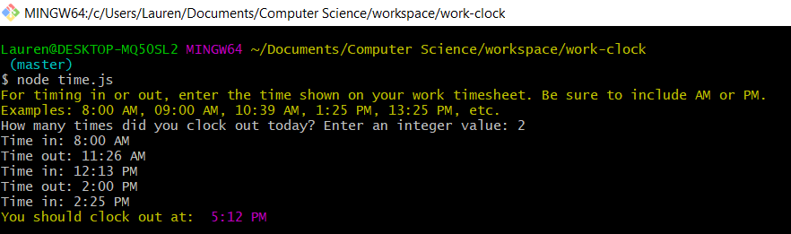

# work-clock

A CLI that lets user know what time they should clock out at work. Built with NodeJS.

## Project Screen Shot

## Installation and Setup Instructions

Clone this repository. You will need `node` and `npm` installed globally on your machine.

Installation:

`npm install`

To Start Program:

`node .\time.js`
